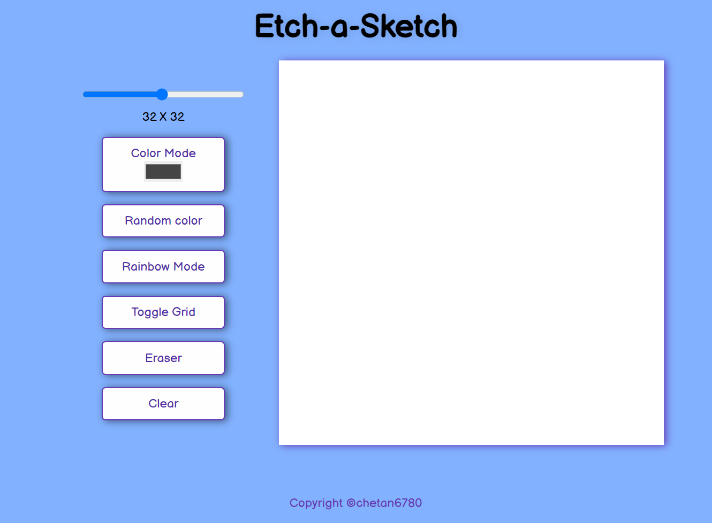
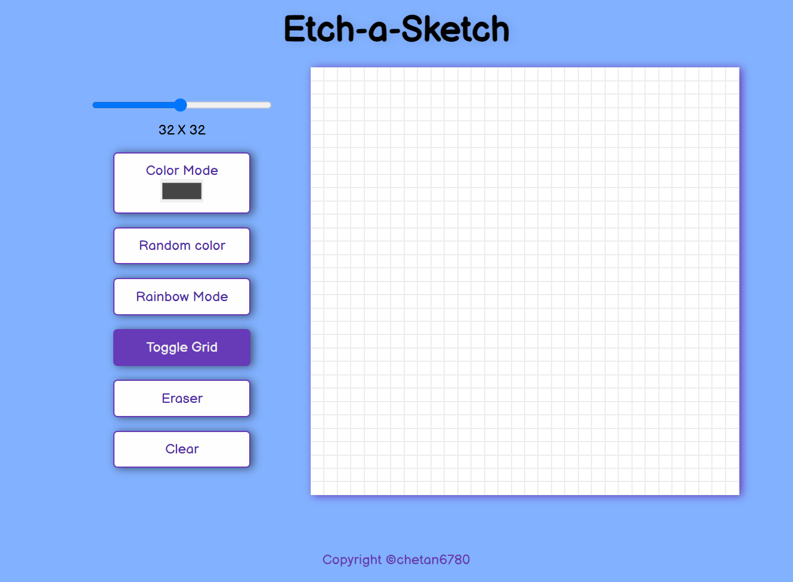
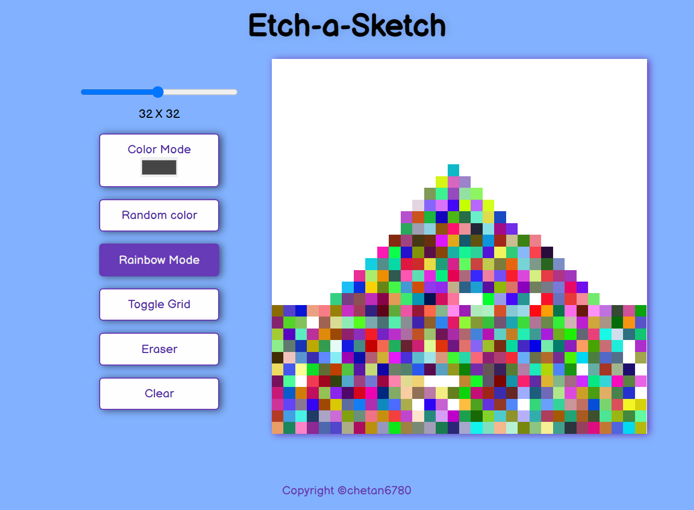
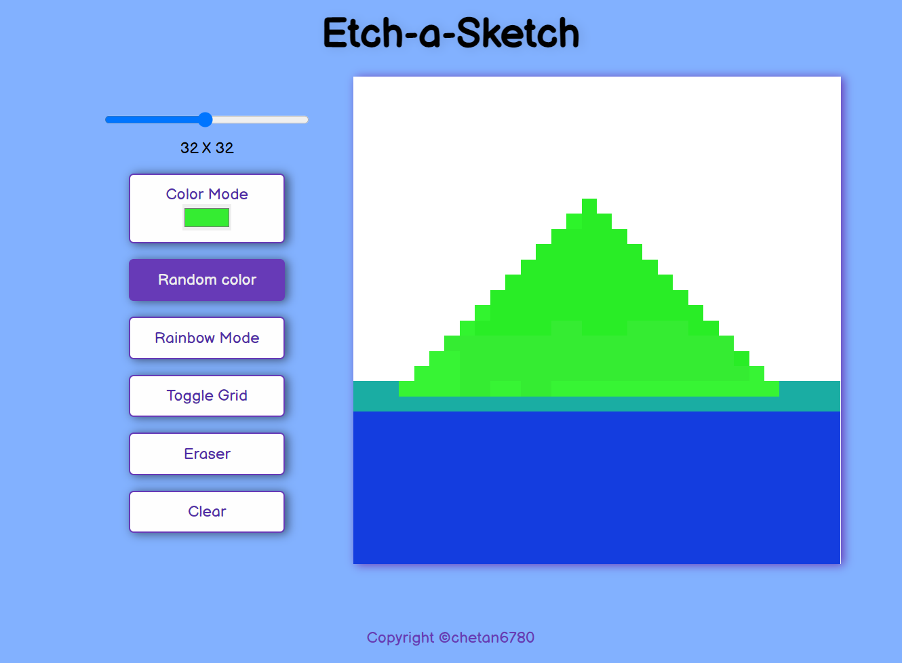
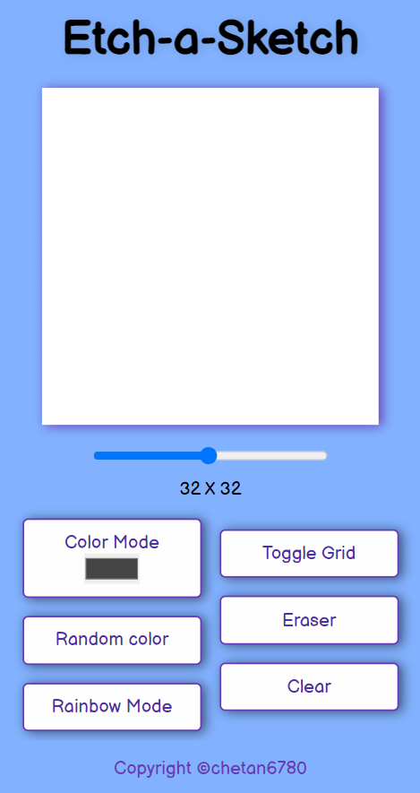
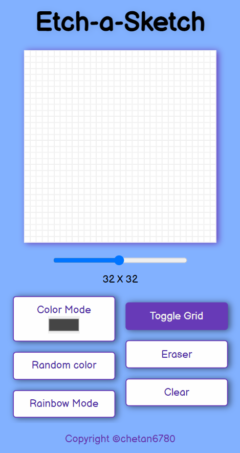

# Etch-a-Sketch

Etch-a-Sketch is a simple and responsive drawing application.
Hosted on Github-Pages click on [Live Application](https://chetan6780.github.io/Etch-a-Sketch/)

# Features

### 1. Canvas without grid:

### 2. Canvas with grid:

### 3. Rainbow Mode:

<!--  -->

### 4. Color mode:

### 5. Random Color Mode:

---

**NOTE:** Due to hover effect does not work on mobile devices Etch-a-Sketch **works only on mouse supported devices**.

    
<b> Mobile Screenshots</b>

    

        
        
    

---

favicon made by <a href="https://www.flaticon.com/authors/pixel-perfect" title="Pixel perfect">Pixel perfect</a> from <a href="https://www.flaticon.com/" title="Flaticon">www.flaticon.com</a>

